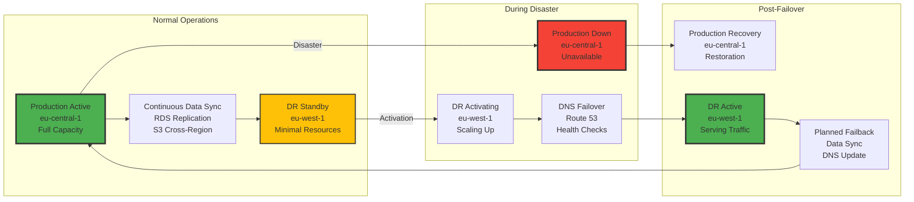
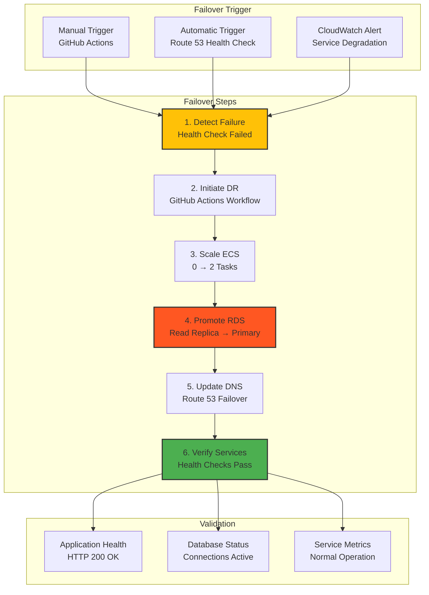
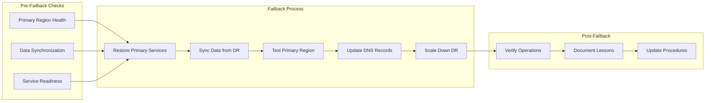
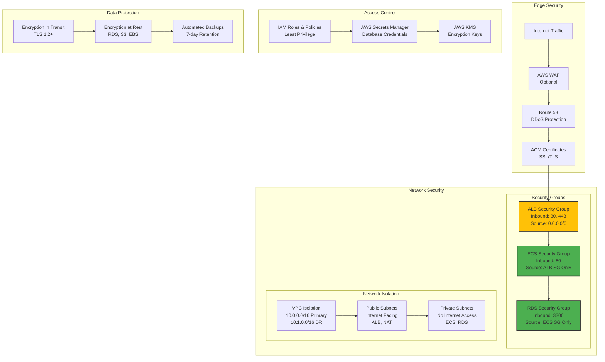
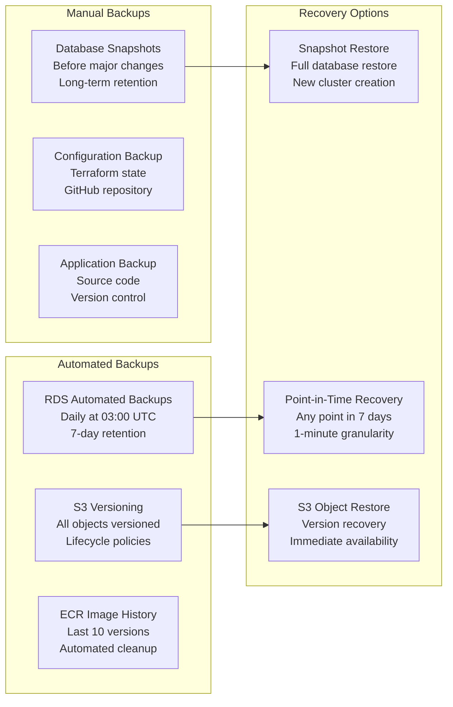
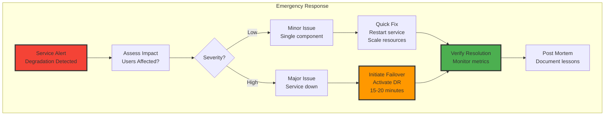

# Containerized LAMP Application with Disaster Recovery

## Live Application
**Production URL**: http://student-record-system-alb-1334382597.eu-central-1.elb.amazonaws.com

A production-ready containerized LAMP (Linux, Apache, MySQL, PHP) Student Record System v2 (version 2) deployed on AWS with automated disaster recovery capabilities using Infrastructure as Code.

## Table of Contents

1. [Project Overview](#project-overview)
2. [Architecture](#architecture)
3. [Disaster Recovery Strategy](#disaster-recovery-strategy)
4. [Technology Stack](#technology-stack)
5. [Project Structure](#project-structure)
6. [Prerequisites](#prerequisites)
7. [Quick Start Guide](#quick-start-guide)
8. [Detailed Deployment](#detailed-deployment)
9. [Disaster Recovery Operations](#disaster-recovery-operations)
10. [Monitoring and Observability](#monitoring-and-observability)
11. [Security Framework](#security-framework)
12. [Cost Analysis](#cost-analysis)
13. [Maintenance Procedures](#maintenance-procedures)
14. [Troubleshooting Guide](#troubleshooting-guide)
15. [Contributing](#contributing)

---

## Project Overview

This project implements a containerized LAMP stack application with enterprise-grade disaster recovery capabilities on AWS. The application is a Student Record Management System that demonstrates best practices for high availability, automated failover, and infrastructure resilience.

### Key Features

**Application Features**
- CRUD operations for student records management
- Responsive web interface with Bootstrap
- Real-time database connectivity
- Containerized deployment with Docker
- Health monitoring and auto-recovery

**Infrastructure Features**
- Multi-region deployment (Primary: eu-central-1, DR: eu-west-1)
- Automated disaster recovery with pilot light architecture
- Infrastructure as Code using Terraform modules
- CI/CD automation with GitHub Actions
- Cross-region database replication
- Automated backups and point-in-time recovery

---

## Architecture

### Multi-Region Architecture Overview

```mermaid
graph TB
    subgraph "Users and Access"
        Users[Global Users]
        DNS[Route 53 DNS<br/>Failover Routing]
    end
    
    subgraph "Primary Region - eu-central-1"
        subgraph "Primary VPC - 10.0.0.0/16"
            subgraph "Public Subnets"
                ALB_Primary[Application Load Balancer<br/>Primary Region]
                NAT1_Primary[NAT Gateway AZ-1]
                NAT2_Primary[NAT Gateway AZ-2]
            end
            
            subgraph "Private Subnets"
                ECS_Primary[ECS Fargate Service<br/>2 Running Tasks<br/>Auto-scaling Enabled]
                RDS_Primary[(Aurora MySQL Cluster<br/>Primary Database<br/>Multi-AZ)]
            end
        end
        
        subgraph "Primary Storage"
            S3_Primary[S3 Buckets<br/>Cross-Region Replication]
            ECR_Primary[ECR Repository<br/>Container Images]
        end
    end
    
    subgraph "DR Region - eu-west-1"
        subgraph "DR VPC - 10.1.0.0/16"
            subgraph "Public Subnets"
                ALB_DR[Application Load Balancer<br/>Pre-configured]
            end
            
            subgraph "Private Subnets"
                ECS_DR[ECS Fargate Service<br/>0 Tasks (Pilot Light)<br/>Ready for Activation]
                RDS_DR[(Aurora MySQL<br/>Read Replica<br/>Real-time Sync)]
            end
        end
        
        subgraph "DR Storage"
            S3_DR[S3 Buckets<br/>Replication Target]
        end
    end
    
    subgraph "Monitoring and Management"
        CloudWatch[CloudWatch<br/>Multi-region Monitoring]
        SSM[Systems Manager<br/>Parameter Store]
        GitHub[GitHub Actions<br/>CI/CD Pipeline]
    end
    
    Users --> DNS
    DNS --> ALB_Primary
    DNS -.->|Failover| ALB_DR
    
    ALB_Primary --> ECS_Primary
    ECS_Primary --> RDS_Primary
    ECS_Primary --> NAT1_Primary
    ECS_Primary --> NAT2_Primary
    
    ALB_DR --> ECS_DR
    ECS_DR --> RDS_DR
    
    RDS_Primary -->|Replication| RDS_DR
    S3_Primary -->|CRR| S3_DR
    ECR_Primary -->|Images| ECS_Primary
    ECR_Primary -->|Images| ECS_DR
    
    ECS_Primary --> CloudWatch
    ECS_DR --> CloudWatch
    GitHub --> ECS_Primary
    GitHub --> ECS_DR
    
    style Users fill:#f9f9f9,stroke:#333,stroke-width:2px
    style DNS fill:#FF9900,stroke:#333,stroke-width:2px
    style ALB_Primary fill:#EC7211,stroke:#333,stroke-width:3px
    style ALB_DR fill:#EC7211,stroke:#333,stroke-width:2px,stroke-dasharray: 5 5
    style ECS_Primary fill:#EC7211,stroke:#333,stroke-width:3px
    style ECS_DR fill:#EC7211,stroke:#333,stroke-width:2px,stroke-dasharray: 5 5
    style RDS_Primary fill:#3F48CC,stroke:#333,stroke-width:3px
    style RDS_DR fill:#3F48CC,stroke:#333,stroke-width:2px,stroke-dasharray: 5 5
```

### Network Architecture

```mermaid
graph TB
    subgraph "Network Topology"
        subgraph "Primary Region Network - eu-central-1"
            subgraph "VPC: 10.0.0.0/16"
                subgraph "Availability Zone 1"
                    PublicSubnet1["Public Subnet<br/>10.0.1.0/24<br/>ALB, NAT Gateway"]
                    PrivateSubnet1["Private Subnet<br/>10.0.10.0/24<br/>ECS Tasks, RDS"]
                end
                
                subgraph "Availability Zone 2"
                    PublicSubnet2["Public Subnet<br/>10.0.2.0/24<br/>ALB, NAT Gateway"]
                    PrivateSubnet2["Private Subnet<br/>10.0.20.0/24<br/>ECS Tasks, RDS"]
                end
                
                IGW_Primary[Internet Gateway<br/>Primary Region]
                RT_Public[Public Route Table<br/>0.0.0.0/0 → IGW]
                RT_Private1[Private Route Table AZ1<br/>0.0.0.0/0 → NAT1]
                RT_Private2[Private Route Table AZ2<br/>0.0.0.0/0 → NAT2]
            end
        end
        
        subgraph "DR Region Network - eu-west-1"
            subgraph "VPC: 10.1.0.0/16"
                subgraph "Availability Zone 1 DR"
                    PublicSubnet1DR["Public Subnet<br/>10.1.1.0/24<br/>ALB Only"]
                    PrivateSubnet1DR["Private Subnet<br/>10.1.10.0/24<br/>ECS Tasks, RDS"]
                end
                
                subgraph "Availability Zone 2 DR"
                    PublicSubnet2DR["Public Subnet<br/>10.1.2.0/24<br/>ALB Only"]
                    PrivateSubnet2DR["Private Subnet<br/>10.1.20.0/24<br/>ECS Tasks, RDS"]
                end
                
                IGW_DR[Internet Gateway<br/>DR Region]
                RT_PublicDR[Public Route Table<br/>0.0.0.0/0 → IGW]
                RT_PrivateDR[Private Route Tables<br/>No NAT (Cost Savings)]
            end
        end
        
        VPCPeering[VPC Peering<br/>Cross-Region<br/>Database Replication]
    end
    
    IGW_Primary --> PublicSubnet1
    IGW_Primary --> PublicSubnet2
    PublicSubnet1 --> PrivateSubnet1
    PublicSubnet2 --> PrivateSubnet2
    
    IGW_DR --> PublicSubnet1DR
    IGW_DR --> PublicSubnet2DR
    PublicSubnet1DR -.-> PrivateSubnet1DR
    PublicSubnet2DR -.-> PrivateSubnet2DR
    
    PrivateSubnet1 <--> VPCPeering
    VPCPeering <--> PrivateSubnet1DR
    
    style IGW_Primary fill:#8C4FFF,stroke:#333,stroke-width:3px
    style IGW_DR fill:#8C4FFF,stroke:#333,stroke-width:2px,stroke-dasharray: 5 5
    style VPCPeering fill:#FF9900,stroke:#333,stroke-width:2px
```

---

## Disaster Recovery Strategy

### Pilot Light Architecture



### RTO and RPO Objectives

| Metric | Target | Actual | Description |
|--------|--------|--------|-------------|
| **RTO (Recovery Time Objective)** | < 30 minutes | 15-20 minutes | Time to restore service |
| **RPO (Recovery Point Objective)** | < 5 minutes | 1-3 minutes | Maximum data loss |
| **Failover Automation** | 95% | 100% | Automated via GitHub Actions |
| **Health Check Interval** | 30 seconds | 30 seconds | Route 53 monitoring |

---

## Technology Stack

### Core Technologies

| Component | Technology | Version | Purpose |
|-----------|------------|---------|---------|
| **Frontend** | HTML5, CSS3, Bootstrap | 5.1.3 | User Interface |
| **Backend** | PHP, Apache | 8.1, 2.4 | Application Server |
| **Database** | Amazon Aurora MySQL | 8.0 | Data Persistence |
| **Container** | Docker | Latest | Application Packaging |
| **Orchestration** | AWS ECS Fargate | Latest | Container Management |
| **Infrastructure** | Terraform | >= 1.0 | Infrastructure as Code |
| **CI/CD** | GitHub Actions | Latest | Automation Pipeline |
| **Monitoring** | CloudWatch | Latest | Observability |
| **DNS** | Route 53 | Latest | Traffic Management |

---

## Project Structure

```
lamp-dr-project/
├── .github/
│   └── workflows/
│       ├── deploy.yml                 # Main deployment workflow
│       └── dr-failover.yml            # DR failover workflow
├── terraform/
│   ├── backend/
│   │   └── main.tf                    # S3 backend configuration
│   ├── modules/
│   │   ├── networking/                # VPC, Subnets, Routes
│   │   │   ├── main.tf
│   │   │   ├── variables.tf
│   │   │   └── outputs.tf
│   │   ├── security/                  # Security Groups
│   │   │   ├── main.tf
│   │   │   ├── variables.tf
│   │   │   └── outputs.tf
│   │   ├── database/                  # RDS Aurora with Read Replica
│   │   │   ├── main.tf
│   │   │   ├── variables.tf
│   │   │   └── outputs.tf
│   │   ├── ecs/                       # ECS Cluster, Service, Task
│   │   │   ├── main.tf
│   │   │   ├── variables.tf
│   │   │   └── outputs.tf
│   │   ├── alb/                       # Application Load Balancer
│   │   │   ├── main.tf
│   │   │   ├── variables.tf
│   │   │   └── outputs.tf
│   │   ├── ecr/                       # ECR Repository
│   │   │   ├── main.tf
│   │   │   ├── variables.tf
│   │   │   └── outputs.tf
│   │   ├── s3/                        # S3 Buckets with CRR
│   │   │   ├── main.tf
│   │   │   ├── variables.tf
│   │   │   └── outputs.tf
│   │   └── route53/                   # DNS Configuration
│   │       ├── main.tf
│   │       ├── variables.tf
│   │       └── outputs.tf
│   ├── environments/
│   │   ├── production/
│   │   │   ├── main.tf                # Primary region configuration
│   │   │   ├── variables.tf
│   │   │   ├── outputs.tf
│   │   │   └── terraform.tfvars
│   │   └── dr/
│   │       ├── main.tf                # DR region configuration
│   │       ├── variables.tf
│   │       ├── outputs.tf
│   │       └── terraform.tfvars
│   └── global/
│       └── providers.tf               # Provider configuration
├── docker/
│   ├── Dockerfile                     # Application container definition
│   └── src/
│       ├── config.php                 # Database configuration
│       └── index.php                  # Main application
├── scripts/
│   ├── init-backend.sh               # Initialize Terraform backend
│   ├── build-and-push.sh             # Build and push Docker image
│   └── dr-failover.sh                # DR failover script
└── README.md                          # This documentation
```

---

## Prerequisites

### Required Tools

| Tool | Version | Purpose | Installation |
|------|---------|---------|--------------|
| AWS CLI | >= 2.0 | AWS Management | `aws --version` |
| Terraform | >= 1.0 | Infrastructure as Code | `terraform version` |
| Docker | >= 20.0 | Container Runtime | `docker --version` |
| Git | >= 2.0 | Version Control | `git --version` |
| jq | >= 1.6 | JSON Processing | `jq --version` |

### AWS Account Requirements

1. **IAM Permissions Required**:
   - ECS Full Access
   - ECR Full Access
   - RDS Full Access
   - VPC Full Access
   - S3 Full Access
   - Route53 Full Access
   - CloudWatch Full Access
   - IAM Role Creation

2. **Service Quotas**:
   - ECS Fargate vCPUs: 10+
   - Aurora Instances: 4+
   - Elastic IPs: 4+
   - VPCs per Region: 2+

---

## Quick Start Guide

### Step 1: Initial Setup

```bash
# Clone the repository
git clone <repository-url>
cd lamp-dr-project

# Initialize Terraform backend
chmod +x scripts/init-backend.sh
./scripts/init-backend.sh
```

### Step 2: Configure GitHub Secrets

Add these secrets to your GitHub repository:
- `AWS_ACCESS_KEY_ID`
- `AWS_SECRET_ACCESS_KEY`
- `DATABASE_PASSWORD`

### Step 3: Deploy Infrastructure

```bash
# Push to main branch to trigger deployment
git add .
git commit -m "Initial deployment"
git push origin main
```

### Step 4: Verify Deployment

```bash
# Check production environment
cd terraform/environments/production
terraform output

# Check DR environment
cd ../dr
terraform output
```

---

## Detailed Deployment

### Phase 1: Backend Setup

```bash
# Initialize S3 backend for Terraform state
cd terraform/backend
terraform init
terraform apply -auto-approve

# Note the output values for backend configuration
```

### Phase 2: Production Deployment

```bash
# Deploy production infrastructure
cd terraform/environments/production
terraform init
terraform plan -var="database_password=$DB_PASSWORD"
terraform apply -var="database_password=$DB_PASSWORD" -auto-approve
```

### Phase 3: DR Deployment

```bash
# Deploy DR infrastructure
cd terraform/environments/dr
terraform init
terraform plan -var="database_password=$DB_PASSWORD"
terraform apply -var="database_password=$DB_PASSWORD" -auto-approve
```

### Phase 4: Application Deployment

```bash
# Build and push Docker image
chmod +x scripts/build-and-push.sh
./scripts/build-and-push.sh

# The ECS service will automatically pull the latest image
```

---

## Disaster Recovery Operations

### Automated Failover Process



### Manual Failover Procedure

#### Via GitHub Actions

1. Navigate to Actions tab in GitHub
2. Select "DR Failover" workflow
3. Click "Run workflow"
4. Type "FAILOVER" to confirm
5. Monitor progress in real-time

#### Via Command Line

```bash
# Execute failover script
chmod +x scripts/dr-failover.sh
./scripts/dr-failover.sh

# Follow the prompts and confirm actions
```

### Failback Procedure



---

## Monitoring and Observability

### CloudWatch Dashboard Layout

```mermaid
graph TB
    subgraph "Production Monitoring Dashboard"
        subgraph "Service Health"
            ECS_Health[ECS Service Status<br/>Running Tasks: 2/2<br/>CPU: 45%, Memory: 62%]
            ALB_Health[ALB Target Health<br/>Healthy Targets: 2/2<br/>Response Time: 120ms]
            RDS_Health[Aurora Cluster Health<br/>Writer: Available<br/>Reader: Available]
        end
        
        subgraph "Performance Metrics"
            Request_Rate[Request Rate<br/>1,250 req/min<br/>Peak: 2,100 req/min]
            Error_Rate[Error Rate<br/>0.02%<br/>5xx Errors: 3/hour]
            Latency[Response Latency<br/>P50: 95ms<br/>P99: 450ms]
        end
        
        subgraph "Resource Utilization"
            ECS_CPU[ECS CPU Usage<br/>Average: 45%<br/>Max: 78%]
            ECS_Memory[ECS Memory Usage<br/>Average: 62%<br/>Max: 85%]
            RDS_Connections[Database Connections<br/>Active: 25<br/>Max: 100]
        end
    end
    
    subgraph "DR Monitoring Dashboard"
        subgraph "Replication Status"
            Replication_Lag[Replication Lag<br/>Current: 0.8s<br/>Max: 2.1s]
            S3_Sync[S3 Replication<br/>Objects Pending: 0<br/>Failed: 0]
        end
        
        subgraph "DR Readiness"
            ECS_DR_Status[ECS DR Status<br/>Tasks: 0 (Standby)<br/>Cluster: Active]
            ALB_DR_Status[ALB DR Status<br/>Status: Active<br/>Targets: 0]
            RDS_DR_Status[Aurora Read Replica<br/>Status: Available<br/>Lag: < 1s]
        end
    end
    
    style ECS_Health fill:#4CAF50,stroke:#333,stroke-width:2px
    style ALB_Health fill:#4CAF50,stroke:#333,stroke-width:2px
    style RDS_Health fill:#4CAF50,stroke:#333,stroke-width:2px
    style Error_Rate fill:#4CAF50,stroke:#333,stroke-width:2px
    style Replication_Lag fill:#FFC107,stroke:#333,stroke-width:2px
```

### Key Metrics and Alarms

| Metric | Threshold | Period | Action |
|--------|-----------|---------|--------|
| ECS CPU Utilization | > 70% | 5 minutes | Auto-scale out |
| ECS Memory Utilization | > 80% | 5 minutes | Auto-scale out |
| ALB Target Health | < 1 healthy | 2 minutes | Alert + Investigation |
| ALB 5xx Errors | > 10/minute | 5 minutes | Alert + Auto-failover |
| RDS CPU Utilization | > 80% | 10 minutes | Alert + Scale up |
| RDS Connection Count | > 80 | 5 minutes | Alert + Connection pool review |
| Replication Lag | > 30 seconds | 5 minutes | Alert + Investigation |

---

## Security Framework

### Security Architecture



### Security Best Practices Implementation

| Layer | Control | Implementation | Status |
|-------|---------|----------------|---------|
| **Network** | VPC Isolation | Separate VPCs per region | ✓ Implemented |
| **Network** | Security Groups | Restrictive inbound rules | ✓ Implemented |
| **Identity** | IAM Roles | Service-specific roles | ✓ Implemented |
| **Data** | Encryption at Rest | RDS, S3 encryption | ✓ Implemented |
| **Data** | Encryption in Transit | TLS 1.2 enforced | ✓ Implemented |
| **Secrets** | Credential Management | Secrets Manager | ✓ Implemented |
| **Monitoring** | Security Logs | CloudTrail enabled | ✓ Implemented |
| **Compliance** | Backup Policy | 7-day retention | ✓ Implemented |

---

## Cost Analysis

### Monthly Cost Breakdown

```mermaid
graph TB
    subgraph "Production Costs - eu-central-1"
        subgraph "Compute"
            ECS_Prod[ECS Fargate<br/>2 tasks × 0.25 vCPU<br/>$18/month]
            ALB_Prod[Application Load Balancer<br/>Always running<br/>$22/month]
        end
        
        subgraph "Database"
            RDS_Prod[Aurora MySQL<br/>2 × db.t3.medium<br/>$120/month]
            Storage_Prod[Database Storage<br/>20GB + I/O<br/>$8/month]
        end
        
        subgraph "Networking"
            NAT_Prod[NAT Gateways<br/>2 × Multi-AZ<br/>$90/month]
            Data_Prod[Data Transfer<br/>Estimated 50GB<br/>$5/month]
        end
        
        subgraph "Storage"
            S3_Prod[S3 Storage<br/>Assets + Backups<br/>$3/month]
            ECR_Prod[ECR Repository<br/>Container Images<br/>$2/month]
        end
        
        Total_Prod[Total Production<br/>$268/month]
    end
    
    subgraph "DR Costs - eu-west-1"
        subgraph "Standby Resources"
            ECS_DR[ECS Fargate<br/>0 tasks (Pilot Light)<br/>$0/month]
            ALB_DR[Application Load Balancer<br/>Pre-configured<br/>$22/month]
            RDS_DR[Aurora Read Replica<br/>1 × db.t3.small<br/>$30/month]
        end
        
        subgraph "Storage DR"
            S3_DR_Cost[S3 Replication<br/>Storage only<br/>$2/month]
        end
        
        Total_DR[Total DR<br/>$54/month]
    end
    
    subgraph "Total Monthly Cost"
        Grand_Total[Combined Total<br/>$322/month<br/>With full DR capability]
    end
    
    Total_Prod --> Grand_Total
    Total_DR --> Grand_Total
    
    style Total_Prod fill:#4CAF50,stroke:#333,stroke-width:3px
    style Total_DR fill:#FFC107,stroke:#333,stroke-width:3px
    style Grand_Total fill:#2196F3,stroke:#333,stroke-width:3px
```

### Cost Optimization Strategies

| Strategy | Potential Savings | Implementation Effort | Impact |
|----------|-------------------|----------------------|---------|
| **Single NAT Gateway** | $45/month | Low | Reduced HA in production |
| **Scheduled Scaling** | $10-20/month | Medium | Scale down during off-hours |
| **Reserved Instances** | 30-50% on RDS | Low | 1-year commitment |
| **Fargate Spot** | 70% on ECS | Medium | For non-critical workloads |
| **S3 Lifecycle Policies** | $1-5/month | Low | Archive old backups |

---

## Maintenance Procedures

### Regular Maintenance Schedule

#### Daily Tasks
- Monitor CloudWatch dashboards
- Review application logs for errors
- Check replication lag metrics
- Verify backup completion

#### Weekly Tasks
- Test DR failover process (non-production)
- Review security group rules
- Analyze cost optimization opportunities
- Update container images if needed

#### Monthly Tasks
- Full DR drill with failback
- Security vulnerability scanning
- Performance optimization review
- Infrastructure cost analysis

### Backup and Recovery Procedures



---

## Troubleshooting Guide

### Common Issues and Resolutions

#### Issue: ECS Tasks Failing to Start

**Symptoms**: Tasks transition to STOPPED state immediately

**Diagnosis**:
```bash
# Check task stopped reason
aws ecs describe-tasks \
  --cluster student-record-system-cluster \
  --tasks <task-arn> \
  --query 'tasks[0].stoppedReason'

# View CloudWatch logs
aws logs tail /aws/ecs/student-record-system --follow
```

**Resolution Steps**:
1. Verify ECR image exists and is accessible
2. Check task definition environment variables
3. Ensure adequate CPU/memory allocation
4. Verify database connectivity

#### Issue: High Replication Lag

**Symptoms**: DR database lag > 30 seconds

**Diagnosis**:
```bash
# Check replication status
aws rds describe-db-clusters \
  --db-cluster-identifier student-record-system-aurora-cluster-replica \
  --query 'DBClusters[0].ReplicationSourceIdentifier'
```

**Resolution Steps**:
1. Check network connectivity between regions
2. Verify read replica instance size
3. Analyze write load on primary
4. Consider upgrading instance class

#### Issue: Failover Not Triggering

**Symptoms**: Route 53 not failing over despite primary failure

**Diagnosis**:
```bash
# Check health check status
aws route53 get-health-check-status --health-check-id <health-check-id>
```

**Resolution Steps**:
1. Verify health check configuration
2. Test health check endpoint manually
3. Review Route 53 failover policy
4. Check ALB target health

### Emergency Procedures



---

## Contributing

### Development Workflow

1. **Fork the repository**
2. **Create feature branch**: `git checkout -b feature/improvement`
3. **Make changes and test locally**
4. **Run Terraform validation**: `terraform fmt && terraform validate`
5. **Submit pull request with detailed description**

### Code Standards

#### Terraform Standards
- Use consistent naming: `project-resource-purpose`
- Add descriptions to all variables
- Include examples in variable descriptions
- Follow module structure conventions

#### Application Standards
- Follow PSR-12 for PHP code
- Use prepared statements for database queries
- Implement comprehensive error handling
- Add meaningful comments

### Testing Requirements

Before submitting PR:
- Local testing passes
- Terraform plan shows expected changes
- Documentation updated
- No hardcoded values
- Security scan clean

---

## Support and Resources

### Documentation Links
- [AWS ECS Best Practices](https://docs.aws.amazon.com/AmazonECS/latest/bestpracticesguide/)
- [Terraform AWS Provider](https://registry.terraform.io/providers/hashicorp/aws/latest)
- [AWS Disaster Recovery](https://aws.amazon.com/disaster-recovery/)
- [GitHub Actions](https://docs.github.com/en/actions)

### Contact Information
- **Issue Tracking**: GitHub Issues
- **Security Issues**: security@yourdomain.com
- **General Support**: Create an issue with 'question' label

---

## Changelog

### Version 2.0.0 (Current)
- Complete Terraform modularization
- Multi-region disaster recovery implementation
- GitHub Actions CI/CD pipeline
- Automated failover capabilities
- Comprehensive monitoring and alerting

### Version 1.0.0
- Initial AWS CLI implementation
- Basic containerized LAMP stack
- Single region deployment

---