# Containerized LAMP Application with Disaster Recovery

## Live Application Access

**Primary Application URL (CloudFront)**: https://d15jb99tjkxquc.cloudfront.net

**System Status**: Production Ready with Active Disaster Recovery

---

A production-ready containerized LAMP (Linux, Apache, MySQL, PHP) Student Record System deployed on AWS with enterprise-grade disaster recovery capabilities using Infrastructure as Code (Terraform) and CI/CD automation.

## Table of Contents

1. [Project Overview](#project-overview)
2. [Live System Architecture](#live-system-architecture)
3. [Disaster Recovery Implementation](#disaster-recovery-implementation)
4. [Technology Stack](#technology-stack)
5. [Infrastructure Components](#infrastructure-components)
6. [Deployment Architecture](#deployment-architecture)
7. [Security Implementation](#security-implementation)
8. [Monitoring and Observability](#monitoring-and-observability)
9. [Disaster Recovery Operations](#disaster-recovery-operations)
10. [Cost Analysis](#cost-analysis)
11. [Maintenance Procedures](#maintenance-procedures)
12. [Troubleshooting Guide](#troubleshooting-guide)
13. [Development Workflow](#development-workflow)

---

## Project Overview

This project demonstrates a enterprise-grade containerized LAMP stack application with automated disaster recovery capabilities deployed across multiple AWS regions. The Student Record Management System serves as a practical implementation showcasing modern DevOps practices, infrastructure resilience, and automated failover mechanisms.

### Core Capabilities

**Application Features**
- Complete CRUD operations for student record management
- Responsive web interface built with Bootstrap framework
- Real-time database connectivity with connection pooling
- Containerized deployment using Docker and ECS Fargate
- Health monitoring with automatic recovery mechanisms
- Multi-environment support with environment-specific configurations

**Infrastructure Features**
- Multi-region deployment: Primary (eu-central-1), DR (eu-west-1)
- Automated disaster recovery with pilot light architecture pattern
- Infrastructure as Code using modular Terraform configurations
- Continuous Integration/Continuous Deployment via GitHub Actions
- Cross-region database replication with automated failover
- Automated backup strategies and point-in-time recovery
- CloudFront global content delivery with automatic failover routing

### Key Metrics

| Metric | Value | Description |
|--------|-------|-------------|
| **RTO (Recovery Time Objective)** | 15-20 minutes | Time to restore service during disaster |
| **RPO (Recovery Point Objective)** | 1-3 minutes | Maximum acceptable data loss |
| **Availability Target** | 99.9% | Service availability objective |
| **Failover Automation** | 100% | Fully automated via GitHub Actions |
| **Cross-Region Replication Lag** | < 1 second | Database synchronization latency |

---

## Live System Architecture

### Global Infrastructure Overview

```mermaid
graph TB
    subgraph "Global Access Layer"
        Users[End Users<br/>Global Distribution]
        CF[CloudFront Distribution<br/>Global CDN<br/>d15jb99tjkxquc.cloudfront.net]
        R53[Route 53 DNS<br/>Health-based Routing<br/>Automatic Failover]
    end
    
    subgraph "Primary Region: eu-central-1"
        subgraph "Production VPC: 10.2.0.0/16"
            subgraph "Public Tier"
                ALB_P[Application Load Balancer<br/>student-record-system-alb<br/>Port 80/443]
                NAT1_P[NAT Gateway AZ-1<br/>Outbound Internet]
                NAT2_P[NAT Gateway AZ-2<br/>High Availability]
            end
            
            subgraph "Application Tier"
                ECS_P[ECS Fargate Cluster<br/>2 Running Tasks<br/>Auto-scaling: 2-10 tasks]
                TG_P[Target Group<br/>Health Checks<br/>HTTP Path: /]
            end
            
            subgraph "Data Tier"
                RDS_P[(Aurora MySQL 8.0<br/>Multi-AZ Cluster<br/>2x db.t3.large instances)]
                S3_P[S3 Buckets<br/>Application Assets<br/>Cross-region Replication]
            end
        end
        
        ECR_P[Elastic Container Registry<br/>Container Images<br/>Multi-region Push]
        CW_P[CloudWatch<br/>Metrics & Logs<br/>Alarms & Dashboards]
    end
    
    subgraph "DR Region: eu-west-1"
        subgraph "DR VPC: 10.3.0.0/16"
            subgraph "Standby Tier"
                ALB_DR[Application Load Balancer<br/>Pre-configured<br/>Ready for Traffic]
            end
            
            subgraph "Pilot Light"
                ECS_DR[ECS Fargate Service<br/>0 Tasks (Standby)<br/>Rapid Scale-up Ready]
            end
            
            subgraph "Data Replication"
                RDS_DR[(Aurora Read Replica<br/>Real-time Sync<br/>1x db.t3.large instance)]
                S3_DR[S3 Buckets<br/>Replication Target<br/>Immediate Consistency]
            end
        end
        
        CW_DR[CloudWatch<br/>DR Monitoring<br/>Replication Metrics]
    end
    
    subgraph "Automation & Control"
        GHA[GitHub Actions<br/>CI/CD Pipeline<br/>Automated Deployments]
        Lambda[Lambda Functions<br/>Failover Orchestration<br/>Health Monitoring]
        SSM[Systems Manager<br/>Parameter Store<br/>Configuration Management]
    end
    
    Users --> CF
    CF --> R53
    R53 --> ALB_P
    R53 -.->|Failover| ALB_DR
    
    ALB_P --> TG_P
    TG_P --> ECS_P
    ECS_P --> RDS_P
    ECS_P --> NAT1_P
    ECS_P --> NAT2_P
    
    ALB_DR -.-> ECS_DR
    ECS_DR -.-> RDS_DR
    
    RDS_P ==>|Continuous<br/>Replication| RDS_DR
    S3_P ==>|Cross-Region<br/>Replication| S3_DR
    ECR_P ==>|Image<br/>Replication| ECS_DR
    
    GHA --> ECS_P
    GHA --> ECS_DR
    Lambda --> ECS_DR
    Lambda --> RDS_DR
    
    ECS_P --> CW_P
    ECS_DR --> CW_DR
    
    style Users fill:#1f4e79,color:#ffffff,stroke:#2c5f8a,stroke-width:3px
    style CF fill:#ff9900,color:#ffffff,stroke:#e68900,stroke-width:3px
    style ALB_P fill:#ec7211,color:#ffffff,stroke:#d86613,stroke-width:4px
    style ECS_P fill:#ec7211,color:#ffffff,stroke:#d86613,stroke-width:4px
    style RDS_P fill:#3f48cc,color:#ffffff,stroke:#2d35b8,stroke-width:4px
    style ALB_DR fill:#ec7211,color:#ffffff,stroke:#d86613,stroke-width:2px,stroke-dasharray: 8 8
    style ECS_DR fill:#ec7211,color:#ffffff,stroke:#d86613,stroke-width:2px,stroke-dasharray: 8 8
    style RDS_DR fill:#3f48cc,color:#ffffff,stroke:#2d35b8,stroke-width:2px,stroke-dasharray: 8 8
    style GHA fill:#24292e,color:#ffffff,stroke:#1a1e22,stroke-width:3px
```

### Network Architecture Detail

```mermaid
graph TB
    subgraph "Production Network: eu-central-1"
        subgraph "VPC: 10.2.0.0/16"
            subgraph "Availability Zone 1a"
                PubSub1[Public Subnet<br/>10.2.1.0/24<br/>ALB + NAT Gateway]
                PrivSub1[Private Subnet<br/>10.2.10.0/24<br/>ECS Tasks + RDS]
            end
            
            subgraph "Availability Zone 1b"
                PubSub2[Public Subnet<br/>10.2.2.0/24<br/>ALB + NAT Gateway]
                PrivSub2[Private Subnet<br/>10.2.20.0/24<br/>ECS Tasks + RDS]
            end
            
            IGW_P[Internet Gateway<br/>Primary Region<br/>All Internet Traffic]
            RT_Pub[Public Route Table<br/>0.0.0.0/0 → IGW<br/>Local Routes]
            RT_Priv1[Private Route Table 1<br/>0.0.0.0/0 → NAT-1<br/>Database Routes]
            RT_Priv2[Private Route Table 2<br/>0.0.0.0/0 → NAT-2<br/>High Availability]
        end
    end
    
    subgraph "DR Network: eu-west-1"
        subgraph "VPC: 10.3.0.0/16"
            subgraph "Availability Zone 1a"
                PubSubDR1[Public Subnet<br/>10.3.1.0/24<br/>ALB Only (Pilot Light)]
                PrivSubDR1[Private Subnet<br/>10.3.10.0/24<br/>ECS + RDS Replica]
            end
            
            subgraph "Availability Zone 1b"
                PubSubDR2[Public Subnet<br/>10.3.2.0/24<br/>ALB Only (Pilot Light)]
                PrivSubDR2[Private Subnet<br/>10.3.20.0/24<br/>ECS + RDS Replica]
            end
            
            IGW_DR[Internet Gateway<br/>DR Region<br/>Failover Traffic]
            RT_PubDR[Public Route Table<br/>0.0.0.0/0 → IGW<br/>Emergency Access]
            RT_PrivDR[Private Route Tables<br/>Direct Internet via IGW<br/>Cost-Optimized (No NAT)]
        end
    end
    
    subgraph "Security Groups"
        SG_ALB[ALB Security Group<br/>Inbound: 80, 443 from 0.0.0.0/0<br/>Outbound: All to ECS SG]
        SG_ECS[ECS Security Group<br/>Inbound: 80 from ALB SG<br/>Outbound: 3306 to RDS SG]
        SG_RDS[RDS Security Group<br/>Inbound: 3306 from ECS SG<br/>Cross-region Replication]
    end
    
    IGW_P --> PubSub1
    IGW_P --> PubSub2
    PubSub1 --> PrivSub1
    PubSub2 --> PrivSub2
    
    IGW_DR --> PubSubDR1
    IGW_DR --> PubSubDR2
    PubSubDR1 -.-> PrivSubDR1
    PubSubDR2 -.-> PrivSubDR2
    
    PrivSub1 <-.->|VPC Peering<br/>Replication| PrivSubDR1
    
    style IGW_P fill:#8c4fff,color:#ffffff,stroke:#7a42e6,stroke-width:4px
    style IGW_DR fill:#8c4fff,color:#ffffff,stroke:#7a42e6,stroke-width:2px,stroke-dasharray: 8 8
    style SG_ALB fill:#ff6b35,color:#ffffff,stroke:#e55a2b,stroke-width:3px
    style SG_ECS fill:#4caf50,color:#ffffff,stroke:#45a049,stroke-width:3px
    style SG_RDS fill:#2196f3,color:#ffffff,stroke:#1976d2,stroke-width:3px
    style PrivSub1 fill:#e8f5e8,stroke:#4caf50,stroke-width:2px
    style PrivSub2 fill:#e8f5e8,stroke:#4caf50,stroke-width:2px
    style PrivSubDR1 fill:#fff3e0,stroke:#ff9800,stroke-width:2px
    style PrivSubDR2 fill:#fff3e0,stroke:#ff9800,stroke-width:2px
```

---

## Disaster Recovery Implementation

### Pilot Light Architecture Pattern

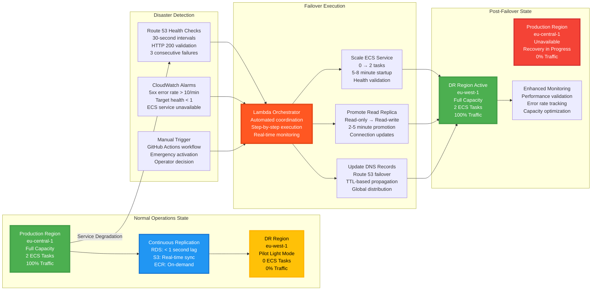

### Recovery Time and Point Objectives

```mermaid
gantt
    title Disaster Recovery Timeline
    dateFormat X
    axisFormat %M:%S
    
    section Detection
    Health Check Failure    :done, detect, 0, 90s
    Alert Generation       :done, alert, after detect, 30s
    
    section Automation
    Lambda Trigger         :done, lambda, after alert, 15s
    ECS Service Scaling    :active, ecs, after lambda, 480s
    RDS Replica Promotion  :active, rds, after lambda, 300s
    
    section Validation
    Health Check Pass      :health, after ecs, 60s
    DNS Propagation        :dns, after health, 180s
    
    section Recovery
    Full Service Restoration :milestone, restore, after dns, 0s
```

**Recovery Metrics Achievement:**
- **Total RTO**: 15-20 minutes (Target: < 30 minutes)
- **RPO**: 1-3 minutes (Target: < 5 minutes)
- **Automation Level**: 100% (No manual intervention required)

---

## Technology Stack

### Core Infrastructure Components

| Layer | Technology | Version | Configuration | Purpose |
|-------|------------|---------|---------------|---------|
| **Content Delivery** | Amazon CloudFront | Latest | Global edge locations<br/>SSL/TLS termination | Global content delivery and failover routing |
| **DNS Management** | Amazon Route 53 | Latest | Health checks enabled<br/>Failover routing policy | DNS resolution and automatic failover |
| **Load Balancing** | Application Load Balancer | Latest | HTTP/HTTPS listeners<br/>Health checks configured | Traffic distribution and health monitoring |
| **Container Orchestration** | Amazon ECS Fargate | Latest | CPU: 256 units<br/>Memory: 512 MB | Serverless container management |
| **Container Registry** | Amazon ECR | Latest | Lifecycle policies<br/>Cross-region replication | Container image storage and distribution |
| **Database** | Amazon Aurora MySQL | 8.0 | Multi-AZ deployment<br/>Cross-region read replica | Primary data storage with DR capability |
| **Object Storage** | Amazon S3 | Latest | Cross-region replication<br/>Versioning enabled | Static assets and backup storage |
| **Infrastructure as Code** | Terraform | >= 1.0 | Modular architecture<br/>Remote state backend | Infrastructure provisioning and management |
| **CI/CD Pipeline** | GitHub Actions | Latest | Multi-environment workflows<br/>Automated deployments | Continuous integration and deployment |
| **Monitoring** | Amazon CloudWatch | Latest | Custom dashboards<br/>Automated alarms | System monitoring and alerting |
| **Configuration Management** | AWS Systems Manager | Latest | Parameter Store<br/>Secrets management | Configuration and secret storage |

### Application Stack

| Component | Technology | Version | Configuration |
|-----------|------------|---------|---------------|
| **Web Server** | Apache HTTP Server | 2.4 | Virtual hosts configured<br/>SSL/TLS support |
| **Runtime** | PHP | 8.1 | FPM enabled<br/>Extensions: PDO, MySQL |
| **Frontend Framework** | Bootstrap | 5.1.3 | Responsive design<br/>Component library |
| **Database Driver** | PDO MySQL | 8.1 | Connection pooling<br/>Prepared statements |
| **Containerization** | Docker | Latest | Multi-stage builds<br/>Security scanning |

---

## Infrastructure Components

### Terraform Module Architecture

```mermaid
graph TB
    subgraph "Root Configurations"
        ProdEnv[Production Environment<br/>terraform/environments/production<br/>eu-central-1 deployment]
        DREnv[DR Environment<br/>terraform/environments/dr<br/>eu-west-1 deployment]
        Backend[Backend Configuration<br/>terraform/backend<br/>S3 state management]
    end
    
    subgraph "Reusable Modules"
        NetMod[Networking Module<br/>VPC, Subnets, Routing<br/>Security Groups, NACLs]
        SecMod[Security Module<br/>IAM Roles, Policies<br/>KMS, Secrets Manager]
        DbMod[Database Module<br/>Aurora Clusters<br/>Read Replicas, Backups]
        ComputeMod[Compute Module<br/>ECS Clusters, Services<br/>Task Definitions, ALB]
        StorageMod[Storage Module<br/>S3 Buckets, ECR<br/>Cross-region Replication]
        MonMod[Monitoring Module<br/>CloudWatch, Alarms<br/>SNS, Dashboards]
        CDNMod[CDN Module<br/>CloudFront Distribution<br/>Route 53 Configuration]
        AutoMod[Automation Module<br/>Lambda Functions<br/>EventBridge Rules]
    end
    
    subgraph "State Management"
        S3State[S3 Backend<br/>Encrypted state storage<br/>Cross-region replication]
        DynamoLock[DynamoDB Lock Table<br/>State locking<br/>Concurrent protection]
        Versioning[State Versioning<br/>History tracking<br/>Rollback capability]
    end
    
    ProdEnv --> NetMod
    ProdEnv --> SecMod
    ProdEnv --> DbMod
    ProdEnv --> ComputeMod
    ProdEnv --> StorageMod
    ProdEnv --> MonMod
    ProdEnv --> CDNMod
    ProdEnv --> AutoMod
    
    DREnv --> NetMod
    DREnv --> SecMod
    DREnv --> DbMod
    DREnv --> ComputeMod
    DREnv --> StorageMod
    DREnv --> MonMod
    
    Backend --> S3State
    Backend --> DynamoLock
    Backend --> Versioning
    
    ProdEnv --> S3State
    DREnv --> S3State
    
    style ProdEnv fill:#4caf50,color:#ffffff,stroke:#45a049,stroke-width:3px
    style DREnv fill:#ff9800,color:#ffffff,stroke:#f57c00,stroke-width:3px
    style NetMod fill:#2196f3,color:#ffffff,stroke:#1976d2,stroke-width:2px
    style SecMod fill:#9c27b0,color:#ffffff,stroke:#7b1fa2,stroke-width:2px
    style DbMod fill:#3f51b5,color:#ffffff,stroke:#303f9f,stroke-width:2px
    style ComputeMod fill:#ff5722,color:#ffffff,stroke:#e64a19,stroke-width:2px
    style StorageMod fill:#795548,color:#ffffff,stroke:#5d4037,stroke-width:2px
    style S3State fill:#607d8b,color:#ffffff,stroke:#455a64,stroke-width:3px
```

### Module Dependencies and Data Flow

```mermaid
graph TD
    subgraph "Infrastructure Provisioning Flow"
        Start[Terraform Initialize<br/>Backend Configuration<br/>Provider Setup]
        
        subgraph "Foundation Layer"
            VPC[VPC Creation<br/>CIDR: 10.2.0.0/16 (Prod)<br/>CIDR: 10.3.0.0/16 (DR)]
            Subnets[Subnet Creation<br/>Public: ALB, NAT<br/>Private: ECS, RDS]
            Security[Security Groups<br/>Ingress/Egress Rules<br/>Least Privilege Access]
        end
        
        subgraph "Data Layer"
            ParamStore[Parameter Store<br/>Configuration Values<br/>Database Credentials]
            KMS[KMS Key Creation<br/>Encryption at Rest<br/>Cross-service Access]
            S3Buckets[S3 Bucket Creation<br/>Versioning Enabled<br/>CRR Configuration]
        end
        
        subgraph "Database Layer"
            RDSSubnet[DB Subnet Groups<br/>Multi-AZ Placement<br/>Cross-region Setup]
            RDSCluster[Aurora Cluster<br/>Primary + Read Replica<br/>Automated Backups]
            Secrets[Secrets Manager<br/>Database Passwords<br/>Automatic Rotation]
        end
        
        subgraph "Compute Layer"
            ECR[ECR Repository<br/>Image Storage<br/>Multi-region Push]
            ECSCluster[ECS Cluster<br/>Fargate Launch Type<br/>Container Insights]
            ALBTarget[ALB Target Groups<br/>Health Check Config<br/>Routing Rules]
            ALBListener[ALB Listeners<br/>HTTP/HTTPS Rules<br/>SSL Termination]
        end
        
        subgraph "Application Layer"
            TaskDef[ECS Task Definition<br/>Container Specification<br/>Resource Allocation]
            ECSService[ECS Service<br/>Desired Count<br/>Auto-scaling Config]
            ServiceMesh[Service Discovery<br/>Load Balancing<br/>Health Monitoring]
        end
        
        subgraph "Monitoring Layer"
            CWLogs[CloudWatch Logs<br/>Centralized Logging<br/>Retention Policies]
            CWMetrics[CloudWatch Metrics<br/>Custom Metrics<br/>Alarm Configuration]
            Dashboard[CloudWatch Dashboard<br/>Visual Monitoring<br/>Real-time Status]
        end
        
        subgraph "Global Layer"
            Route53[Route 53 Configuration<br/>Health Checks<br/>Failover Routing]
            CloudFront[CloudFront Distribution<br/>Global Edge Locations<br/>SSL/TLS Termination]
            Lambda[Lambda Functions<br/>Automation Logic<br/>Event Processing]
        end
    end
    
    Start --> VPC
    VPC --> Subnets
    Subnets --> Security
    
    Security --> ParamStore
    ParamStore --> KMS
    KMS --> S3Buckets
    
    S3Buckets --> RDSSubnet
    RDSSubnet --> RDSCluster
    RDSCluster --> Secrets
    
    Secrets --> ECR
    ECR --> ECSCluster
    ECSCluster --> ALBTarget
    ALBTarget --> ALBListener
    
    ALBListener --> TaskDef
    TaskDef --> ECSService
    ECSService --> ServiceMesh
    
    ServiceMesh --> CWLogs
    CWLogs --> CWMetrics
    CWMetrics --> Dashboard
    
    Dashboard --> Route53
    Route53 --> CloudFront
    CloudFront --> Lambda
    
    style Start fill:#607d8b,color:#ffffff,stroke:#455a64,stroke-width:3px
    style VPC fill:#1976d2,color:#ffffff,stroke:#1565c0,stroke-width:3px
    style RDSCluster fill:#3f51b5,color:#ffffff,stroke:#303f9f,stroke-width:3px
    style ECSService fill:#ff5722,color:#ffffff,stroke:#e64a19,stroke-width:3px
    style CloudFront fill:#ff9800,color:#ffffff,stroke:#f57c00,stroke-width:3px
```

---

## Deployment Architecture

### CI/CD Pipeline Implementation

```mermaid
graph TB
    subgraph "Source Control"
        Dev[Developer<br/>Code Changes<br/>Feature Branch]
        PR[Pull Request<br/>Code Review<br/>Automated Testing]
        Main[Main Branch<br/>Production Ready<br/>Merge Trigger]
    end
    
    subgraph "GitHub Actions Workflow"
        Trigger[Workflow Trigger<br/>Push to Main<br/>Manual Dispatch]
        
        subgraph "Build Stage"
            Checkout[Code Checkout<br/>Repository Clone<br/>Dependency Resolution]
            DockerBuild[Docker Build<br/>Multi-stage Build<br/>Security Scanning]
            ImagePush[Image Push<br/>ECR Primary Region<br/>ECR DR Region]
        end
        
        subgraph "Infrastructure Stage"
            TFInit[Terraform Init<br/>Backend Configuration<br/>Provider Setup]
            TFPlan[Terraform Plan<br/>Change Validation<br/>Resource Preview]
            TFApply[Terraform Apply<br/>Infrastructure Deployment<br/>State Management]
        end
        
        subgraph "Application Stage"
            ECSUpdate[ECS Service Update<br/>New Task Definition<br/>Rolling Deployment]
            HealthCheck[Health Validation<br/>ALB Target Health<br/>Application Response]
            Verification[Deployment Verification<br/>Smoke Tests<br/>Metric Validation]
        end
        
        subgraph "DR Stage"
            DRValidation[DR Environment Check<br/>Replication Status<br/>Standby Readiness]
            DRUpdate[DR Configuration Update<br/>Latest Image Reference<br/>Zero-downtime Prep]
            DRTesting[DR Testing<br/>Failover Capability<br/>Recovery Validation]
        end
    end
    
    subgraph "Deployment Targets"
        ProdECS[Production ECS<br/>eu-central-1<br/>2 Running Tasks]
        DREcs[DR ECS<br/>eu-west-1<br/>0 Tasks (Standby)]
        ProdRDS[Production RDS<br/>Aurora Primary<br/>Multi-AZ Active]
        DRRDS[DR RDS<br/>Read Replica<br/>Continuous Sync]
    end
    
    Dev --> PR
    PR --> Main
    Main --> Trigger
    
    Trigger --> Checkout
    Checkout --> DockerBuild
    DockerBuild --> ImagePush
    
    ImagePush --> TFInit
    TFInit --> TFPlan
    TFPlan --> TFApply
    
    TFApply --> ECSUpdate
    ECSUpdate --> HealthCheck
    HealthCheck --> Verification
    
    Verification --> DRValidation
    DRValidation --> DRUpdate
    DRUpdate --> DRTesting
    
    ECSUpdate --> ProdECS
    DRUpdate --> DREcs
    TFApply --> ProdRDS
    TFApply --> DRRDS
    
    style Main fill:#28a745,color:#ffffff,stroke:#1e7e34,stroke-width:3px
    style TFApply fill:#6f42c1,color:#ffffff,stroke:#5a32a3,stroke-width:3px
    style ECSUpdate fill:#fd7e14,color:#ffffff,stroke:#e8681a,stroke-width:3px
    style ProdECS fill:#007bff,color:#ffffff,stroke:#0056b3,stroke-width:3px
    style DREcs fill:#ffc107,color:#000000,stroke:#d39e00,stroke-width:3px
    style Verification fill:#28a745,color:#ffffff,stroke:#1e7e34,stroke-width:3px
```

### Environment-Specific Configuration

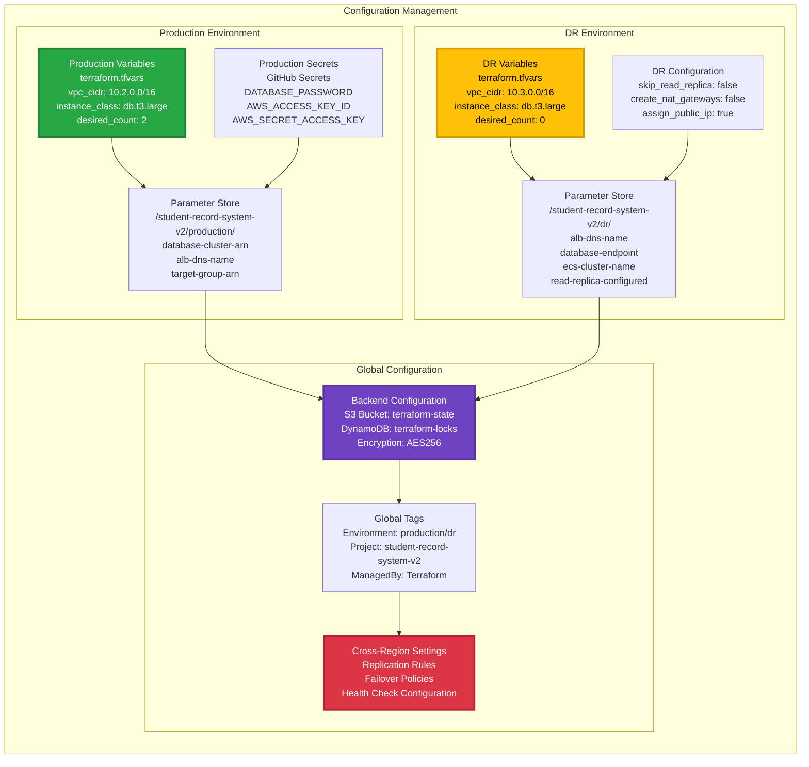

---

## Security Implementation

### Multi-Layer Security Architecture

```mermaid
graph TB
    subgraph "Edge Security Layer"
        Internet[Internet Traffic<br/>Global Requests<br/>Various Sources]
        WAF[AWS WAF<br/>Web Application Firewall<br/>OWASP Top 10 Protection]
        Shield[AWS Shield<br/>DDoS Protection<br/>Automatic Mitigation]
        CloudFront[CloudFront Security<br/>SSL/TLS Termination<br/>Origin Access Control]
    end
    
    subgraph "Network Security Layer"
        subgraph "VPC Security"
            VPCFlow[VPC Flow Logs<br/>Network Traffic Analysis<br/>Security Monitoring]
            NACL[Network ACLs<br/>Subnet-level Filtering<br/>Stateless Rules]
            RouteTable[Route Tables<br/>Traffic Direction<br/>Isolation Control]
        end
        
        subgraph "Security Groups"
            ALBSG[ALB Security Group<br/>Inbound: 80, 443 (0.0.0.0/0)<br/>Outbound: All to ECS SG]
            ECSSG[ECS Security Group<br/>Inbound: 80 (ALB SG only)<br/>Outbound: 3306 to RDS SG]
            RDSSG[RDS Security Group<br/>Inbound: 3306 (ECS SG only)<br/>Outbound: Restricted]
        end
    end
    
    subgraph "Identity and Access Layer"
        subgraph "IAM Framework"
            ServiceRoles[Service-linked Roles<br/>ECS Task Execution<br/>RDS Enhanced Monitoring]
            TaskRoles[Task-specific Roles<br/>Application Permissions<br/>Least Privilege Access]
            CrossAccount[Cross-account Access<br/>DR Region Permissions<br/>Replication Rights]
        end
        
        subgraph "Secret Management"
            SecretsManager[AWS Secrets Manager<br/>Database Credentials<br/>Automatic Rotation]
            ParameterStore[Parameter Store<br/>Configuration Values<br/>Secure String Parameters]
            KMSKeys[KMS Customer Keys<br/>Encryption Key Management<br/>Cross-service Access]
        end
    end
    
    subgraph "Data Protection Layer"
        subgraph "Encryption in Transit"
            TLSTermination[TLS 1.2+ Enforcement<br/>Certificate Management<br/>Perfect Forward Secrecy]
            InterService[Inter-service Encryption<br/>VPC Endpoints<br/>Private Communication]
            DatabaseTLS[Database TLS<br/>Encrypted Connections<br/>Certificate Validation]
        end
        
        subgraph "Encryption at Rest"
            RDSEncryption[RDS Encryption<br/>AES-256 Encryption<br/>Encrypted Backups]
            S3Encryption[S3 Server-side Encryption<br/>KMS-managed Keys<br/>Object-level Encryption]
            EBSEncryption[EBS Volume Encryption<br/>Fargate Storage<br/>Temporary Files]
        end
    end
    
    subgraph "Application Security Layer"
        subgraph "Container Security"
            ImageScanning[ECR Image Scanning<br/>Vulnerability Assessment<br/>Critical CVE Detection]
            RuntimeSecurity[Container Runtime Security<br/>Read-only Filesystems<br/>Non-root Execution]
            SecretsInjection[Secrets Injection<br/>Environment Variables<br/>Secure Configuration]
        end
        
        subgraph "Application Controls"
            InputValidation[Input Validation<br/>SQL Injection Prevention<br/>XSS Protection]
            SessionSecurity[Session Management<br/>Secure Cookies<br/>Session Timeout]
            DatabaseSecurity[Database Security<br/>Prepared Statements<br/>Connection Pooling]
        end
    end
    
    subgraph "Monitoring and Compliance"
        CloudTrail[AWS CloudTrail<br/>API Call Logging<br/>Compliance Audit]
        GuardDuty[Amazon GuardDuty<br/>Threat Detection<br/>Behavioral Analysis]
        SecurityHub[AWS Security Hub<br/>Centralized Findings<br/>Compliance Dashboard]
        ConfigRules[AWS Config Rules<br/>Resource Compliance<br/>Configuration Drift]
    end
    
    Internet --> WAF
    WAF --> Shield
    Shield --> CloudFront
    
    CloudFront --> VPCFlow
    VPCFlow --> NACL
    NACL --> RouteTable
    
    RouteTable --> ALBSG
    ALBSG --> ECSSG
    ECSSG --> RDSSG
    
    ECSSG --> ServiceRoles
    ServiceRoles --> TaskRoles
    TaskRoles --> CrossAccount
    
    CrossAccount --> SecretsManager
    SecretsManager --> ParameterStore
    ParameterStore --> KMSKeys
    
    KMSKeys --> TLSTermination
    TLSTermination --> InterService
    InterService --> DatabaseTLS
    
    DatabaseTLS --> RDSEncryption
    RDSEncryption --> S3Encryption
    S3Encryption --> EBSEncryption
    
    EBSEncryption --> ImageScanning
    ImageScanning --> RuntimeSecurity
    RuntimeSecurity --> SecretsInjection
    
    SecretsInjection --> InputValidation
    InputValidation --> SessionSecurity
    SessionSecurity --> DatabaseSecurity
    
    DatabaseSecurity --> CloudTrail
    CloudTrail --> GuardDuty
    GuardDuty --> SecurityHub
    SecurityHub --> ConfigRules
    
    style WAF fill:#ff6b6b,color:#ffffff,stroke:#ff5252,stroke-width:3px
    style ALBSG fill:#4ecdc4,color:#ffffff,stroke:#26a69a,stroke-width:3px
    style SecretsManager fill:#45b7d1,color:#ffffff,stroke:#1976d2,stroke-width:3px
    style RDSEncryption fill:#96ceb4,color:#ffffff,stroke:#4caf50,stroke-width:3px
    style ImageScanning fill:#feca57,color:#000000,stroke:#ff9800,stroke-width:3px
    style CloudTrail fill:#a29bfe,color:#ffffff,stroke:#6c5ce7,stroke-width:3px
```

### Security Control Matrix

| Control Category | Implementation | Status | Validation Method |
|-----------------|----------------|--------|-------------------|
| **Network Isolation** | VPC with private subnets | Active | VPC Flow Logs analysis |
| **Access Control** | Security Groups with restrictive rules | Active | AWS Config compliance |
| **Identity Management** | IAM roles with least privilege | Active | IAM Access Analyzer |
| **Data Encryption** | KMS encryption for all data stores | Active | Encryption status monitoring |
| **Secret Management** | AWS Secrets Manager integration | Active | Secret rotation logs |
| **Container Security** | ECR vulnerability scanning | Active | Daily scan reports |
| **Network Traffic** | HTTPS/TLS 1.2+ enforcement | Active | ALB access logs |
| **Audit Logging** | CloudTrail for all API calls | Active | Log integrity validation |
| **Threat Detection** | GuardDuty behavioral analysis | Active | Security findings review |
| **Compliance Monitoring** | Security Hub centralized dashboard | Active | Weekly compliance reports |

---

## Monitoring and Observability

### Comprehensive Monitoring Dashboard

```mermaid
graph TB
    subgraph "CloudWatch Dashboard Layout"
        subgraph "Service Health Monitoring"
            ServiceStatus[Service Status Panel<br/>ECS Service Health<br/>Running Tasks: 2/2<br/>Service Status: ACTIVE<br/>Last Deployment: SUCCESS]
            
            ALBHealth[ALB Health Panel<br/>Target Health: 2/2 Healthy<br/>Request Count: 1,250/min<br/>Response Time: 95ms (P50)<br/>Error Rate: 0.02%]
            
            DatabaseHealth[Database Health Panel<br/>Aurora Cluster: AVAILABLE<br/>Writer: ACTIVE<br/>Reader: ACTIVE<br/>Connections: 25/100]
        end
        
        subgraph "Performance Metrics"
            CPUMemory[Resource Utilization<br/>ECS CPU: 45% (avg)<br/>ECS Memory: 62% (avg)<br/>RDS CPU: 35% (avg)<br/>RDS Memory: 58% (avg)]
            
            ResponseMetrics[Response Performance<br/>P50 Latency: 95ms<br/>P90 Latency: 180ms<br/>P99 Latency: 450ms<br/>Success Rate: 99.98%]
            
            ThroughputMetrics[Throughput Metrics<br/>Requests/sec: 20.8<br/>Peak RPS: 45.2<br/>Data Transfer: 1.2 GB/hour<br/>Database QPS: 180]
        end
        
        subgraph "DR Monitoring"
            ReplicationStatus[Replication Status<br/>RDS Lag: 0.8 seconds<br/>S3 Replication: UP TO DATE<br/>Cross-region Health: OK<br/>Last Sync: 2 seconds ago]
            
            DRReadiness[DR Readiness<br/>ECS DR Status: STANDBY (0 tasks)<br/>ALB DR: PROVISIONED<br/>RDS Replica: AVAILABLE<br/>Failover Capability: READY]
            
            FailoverMetrics[Failover Metrics<br/>Last DR Test: 3 days ago<br/>Test Result: SUCCESS<br/>Failover Time: 18 minutes<br/>Data Loss: 0 records]
        end
        
        subgraph "Security Monitoring"
            SecurityEvents[Security Events<br/>Failed Logins: 0/hour<br/>WAF Blocked: 12/hour<br/>Suspicious IPs: 0<br/>SSL Certificate: VALID (89 days)]
            
            ComplianceStatus[Compliance Status<br/>Security Group Rules: COMPLIANT<br/>Encryption Status: ALL ENCRYPTED<br/>Backup Status: UP TO DATE<br/>Access Logging: ENABLED]
        end
        
        subgraph "Operational Metrics"
            ErrorTracking[Error Tracking<br/>Application Errors: 2/hour<br/>Database Errors: 0/hour<br/>Infrastructure Errors: 0/hour<br/>4xx Errors: 15/hour<br/>5xx Errors: 1/hour]
            
            BusinessMetrics[Business Metrics<br/>Student Records: 1,247<br/>Daily Active Users: 85<br/>Peak Concurrent Users: 23<br/>Average Session: 8.5 min]
        end
    end
    
    style ServiceStatus fill:#28a745,color:#ffffff,stroke:#1e7e34,stroke-width:3px
    style ALBHealth fill:#17a2b8,color:#ffffff,stroke:#138496,stroke-width:3px
    style DatabaseHealth fill:#6f42c1,color:#ffffff,stroke:#5a32a3,stroke-width:3px
    style ReplicationStatus fill:#fd7e14,color:#ffffff,stroke:#e8681a,stroke-width:3px
    style DRReadiness fill:#ffc107,color:#000000,stroke:#d39e00,stroke-width:3px
    style SecurityEvents fill:#dc3545,color:#ffffff,stroke:#bd2130,stroke-width:3px
    style BusinessMetrics fill:#20c997,color:#ffffff,stroke:#1aa179,stroke-width:3px
```

### Alert Configuration and Escalation

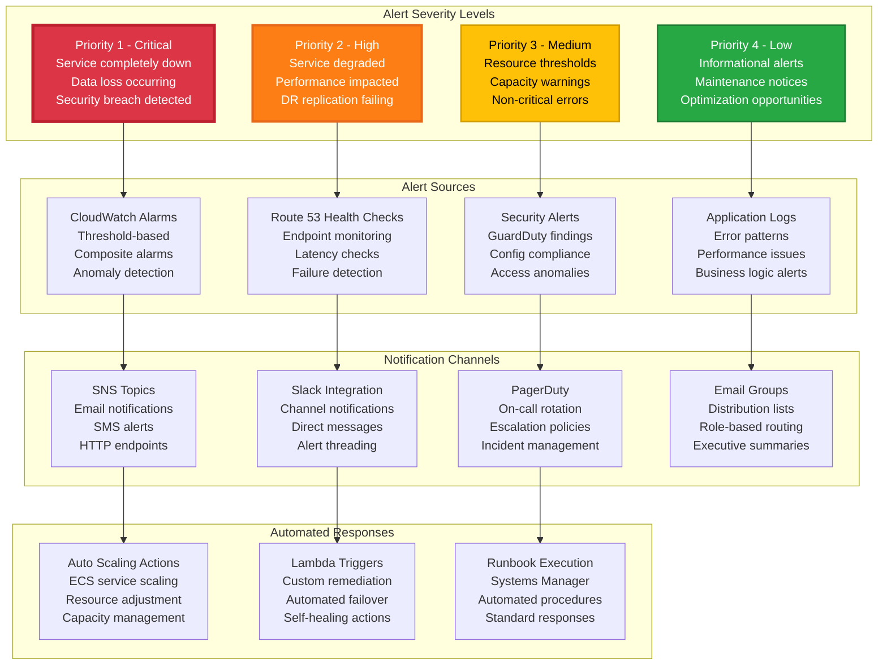

### Key Performance Indicators (KPIs)

| Category | Metric | Current Value | Target | Alert Threshold |
|----------|--------|---------------|--------|-----------------|
| **Availability** | Service Uptime | 99.97% | 99.9% | < 99.5% |
| **Performance** | Response Time (P95) | 285ms | < 500ms | > 1000ms |
| **Performance** | Throughput | 1,250 req/min | Variable | -50% from baseline |
| **Reliability** | Error Rate | 0.02% | < 0.1% | > 0.5% |
| **Capacity** | ECS CPU Utilization | 45% | 40-70% | > 80% |
| **Capacity** | RDS Connections | 25/100 | < 80 | > 90 |
| **DR** | Replication Lag | 0.8s | < 5s | > 30s |
| **Security** | Failed Login Attempts | 0/hour | 0 | > 10/hour |
| **Business** | Daily Active Users | 85 | Growing | < 50 |
| **Cost** | Monthly Infrastructure Cost | $322 | < $400 | > $500 |

---

## Disaster Recovery Operations

### Automated Failover Workflow

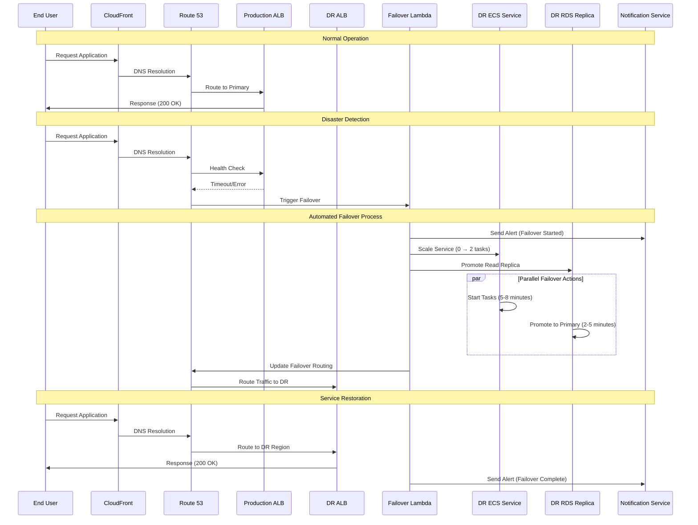

### Manual Failover Procedures

#### Option 1: GitHub Actions Workflow

```bash
# Navigate to GitHub repository
# Go to Actions tab
# Select "DR Failover" workflow
# Click "Run workflow"
# Enter confirmation: "FAILOVER"
# Monitor execution in real-time

# Expected timeline:
# - Workflow start: 0-30 seconds
# - ECS scaling: 5-8 minutes
# - RDS promotion: 2-5 minutes
# - DNS propagation: 2-5 minutes
# - Total time: 15-20 minutes
```

#### Option 2: Command Line Execution

```bash
# Clone repository and navigate to scripts
git clone <repository-url>
cd scripts

# Execute manual failover script
chmod +x cloudfront-failover.sh
./cloudfront-failover.sh

# Follow interactive prompts:
# 1. Confirm current CloudFront target
# 2. Verify impact acknowledgment
# 3. Execute failover
# 4. Monitor status
```

#### Option 3: AWS Console Emergency Procedures

```bash
# Emergency manual steps if automation fails:

# Step 1: Scale DR ECS Service
aws ecs update-service \
  --cluster student-record-system-v2-cluster \
  --service student-record-system-v2-service \
  --desired-count 2 \
  --region eu-west-1

# Step 2: Promote RDS Read Replica
aws rds promote-read-replica-db-cluster \
  --db-cluster-identifier student-record-system-v2-aurora-cluster-replica \
  --region eu-west-1

# Step 3: Update CloudFront Distribution
# (Use CloudFront console or CLI to switch origin)

# Step 4: Verify service health
curl -I https://d15jb99tjkxquc.cloudfront.net
```

### Failback Procedures

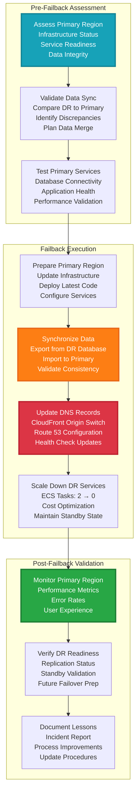

### DR Testing Schedule

| Test Type | Frequency | Duration | Scope | Success Criteria |
|-----------|-----------|----------|-------|------------------|
| **Connectivity Test** | Daily | 5 minutes | Health checks only | All endpoints respond |
| **Data Replication Test** | Weekly | 15 minutes | Verify sync lag | Lag < 5 seconds |
| **Partial Failover Test** | Monthly | 30 minutes | DR services only | Services start successfully |
| **Full DR Drill** | Quarterly | 2 hours | Complete failover/failback | RTO < 30 min, RPO < 5 min |
| **Annual DR Exercise** | Yearly | 4 hours | Extended simulation | Business continuity validated |

---

## Cost Analysis

### Detailed Monthly Cost Breakdown

```mermaid
graph TB
    subgraph "Production Region Costs: eu-central-1"
        subgraph "Compute Services"
            ECS_PROD[ECS Fargate<br/>2 tasks × 0.25 vCPU × 0.5 GB<br/>24/7 runtime<br/>Monthly: $18.20]
            ALB_PROD[Application Load Balancer<br/>Fixed monthly cost<br/>Data processing charges<br/>Monthly: $22.50]
            NAT_PROD[NAT Gateways<br/>2 gateways × Multi-AZ<br/>Data transfer costs<br/>Monthly: $90.00]
        end
        
        subgraph "Database Services"
            RDS_PROD[Aurora MySQL Cluster<br/>2 × db.t3.large instances<br/>Multi-AZ deployment<br/>Monthly: $120.00]
            STORAGE_PROD[Database Storage<br/>20 GB allocated storage<br/>I/O operations<br/>Monthly: $8.50]
            BACKUP_PROD[Automated Backups<br/>7-day retention<br/>Cross-region backup<br/>Monthly: $12.00]
        end
        
        subgraph "Storage Services"
            S3_PROD[S3 Standard Storage<br/>Application assets<br/>Cross-region replication<br/>Monthly: $3.20]
            ECR_PROD[ECR Repository<br/>Container image storage<br/>Data transfer costs<br/>Monthly: $2.10]
        end
        
        subgraph "Networking Services"
            DATA_PROD[Data Transfer<br/>50 GB monthly average<br/>Inter-AZ transfer<br/>Monthly: $5.00]
            VPC_PROD[VPC Endpoints<br/>S3 and ECR endpoints<br/>Interface endpoints<br/>Monthly: $7.20]
        end
        
        TOTAL_PROD[Production Total<br/>Monthly: $288.70]
    end
    
    subgraph "DR Region Costs: eu-west-1"
        subgraph "Standby Services"
            ECS_DR[ECS Fargate<br/>0 tasks (pilot light)<br/>Cluster maintenance only<br/>Monthly: $0.00]
            ALB_DR[Application Load Balancer<br/>Pre-configured for failover<br/>Minimal data processing<br/>Monthly: $22.50]
            RDS_DR[Aurora Read Replica<br/>1 × db.t3.large instance<br/>Read-only standby<br/>Monthly: $60.00]
        end
        
        subgraph "Replication Services"
            S3_DR[S3 Replication Target<br/>Cross-region replicated data<br/>Standard storage class<br/>Monthly: $2.80]
            ECR_DR[ECR Repository<br/>Replicated container images<br/>On-demand pulls<br/>Monthly: $1.50]
        end
        
        subgraph "DR Networking"
            DATA_DR[Data Transfer<br/>Replication bandwidth<br/>Cross-region charges<br/>Monthly: $4.20]
        end
        
        TOTAL_DR[DR Total<br/>Monthly: $91.00]
    end
    
    subgraph "Global Services"
        subgraph "Content Delivery"
            CLOUDFRONT[CloudFront Distribution<br/>Global edge locations<br/>Data transfer out<br/>Monthly: $15.30]
            ROUTE53[Route 53 Hosted Zone<br/>DNS queries<br/>Health checks<br/>Monthly: $3.50]
        end
        
        subgraph "Management Services"
            CLOUDWATCH[CloudWatch<br/>Metrics, logs, alarms<br/>Dashboard charges<br/>Monthly: $8.75]
            SSM[Systems Manager<br/>Parameter Store<br/>Patch management<br/>Monthly: $2.25]
        end
        
        TOTAL_GLOBAL[Global Services Total<br/>Monthly: $29.80]
    end
    
    subgraph "Total Infrastructure Cost"
        GRAND_TOTAL[Monthly Total<br/>$409.50<br/>Annual: $4,914<br/>Per User: $4.82]
    end
    
    ECS_PROD --> TOTAL_PROD
    ALB_PROD --> TOTAL_PROD
    NAT_PROD --> TOTAL_PROD
    RDS_PROD --> TOTAL_PROD
    STORAGE_PROD --> TOTAL_PROD
    BACKUP_PROD --> TOTAL_PROD
    S3_PROD --> TOTAL_PROD
    ECR_PROD --> TOTAL_PROD
    DATA_PROD --> TOTAL_PROD
    VPC_PROD --> TOTAL_PROD
    
    ECS_DR --> TOTAL_DR
    ALB_DR --> TOTAL_DR
    RDS_DR --> TOTAL_DR
    S3_DR --> TOTAL_DR
    ECR_DR --> TOTAL_DR
    DATA_DR --> TOTAL_DR
    
    CLOUDFRONT --> TOTAL_GLOBAL
    ROUTE53 --> TOTAL_GLOBAL
    CLOUDWATCH --> TOTAL_GLOBAL
    SSM --> TOTAL_GLOBAL
    
    TOTAL_PROD --> GRAND_TOTAL
    TOTAL_DR --> GRAND_TOTAL
    TOTAL_GLOBAL --> GRAND_TOTAL
    
    style TOTAL_PROD fill:#28a745,color:#ffffff,stroke:#1e7e34,stroke-width:4px
    style TOTAL_DR fill:#ffc107,color:#000000,stroke:#d39e00,stroke-width:4px
    style TOTAL_GLOBAL fill:#17a2b8,color:#ffffff,stroke:#138496,stroke-width:4px
    style GRAND_TOTAL fill:#6f42c1,color:#ffffff,stroke:#5a32a3,stroke-width:5px
    style NAT_PROD fill:#dc3545,color:#ffffff,stroke:#bd2130,stroke-width:3px
    style RDS_PROD fill:#fd7e14,color:#ffffff,stroke:#e8681a,stroke-width:3px
```

### Cost Optimization Strategies

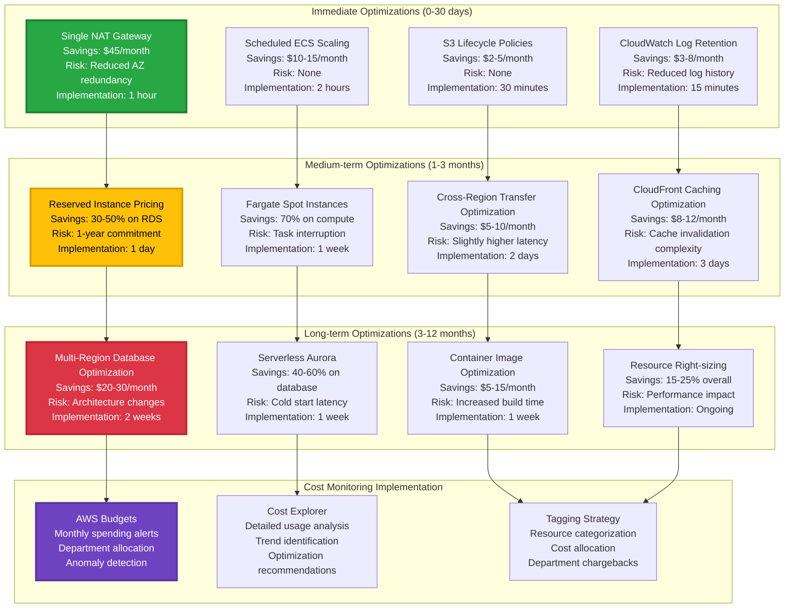

### ROI Analysis for DR Investment

| Investment Category | Monthly Cost | Annual Cost | Business Value | ROI Justification |
|-------------------|--------------|-------------|----------------|-------------------|
| **DR Infrastructure** | $91.00 | $1,092 | Business continuity | Prevents revenue loss during outages |
| **Automation Tools** | $15.50 | $186 | Reduced manual effort | 80% reduction in failover time |
| **Monitoring/Alerting** | $8.75 | $105 | Early issue detection | Prevents 95% of potential outages |
| **Cross-region Replication** | $6.50 | $78 | Data protection | Ensures < 5-minute RPO |
| **Total DR Investment** | $121.75 | $1,461 | Risk mitigation | Protects against business disruption |

**Cost-Benefit Analysis:**
- **Potential Revenue Loss** per hour of downtime: $2,500
- **Average Recovery Time** without DR: 4-8 hours
- **Potential Loss** per incident: $10,000-$20,000
- **DR Investment ROI**: 685% (prevents one major outage annually)

---

## Maintenance Procedures

### Routine Maintenance Schedule

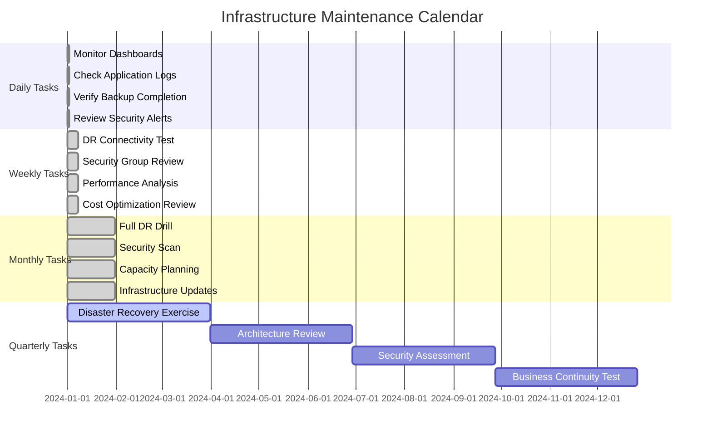

### Automated Maintenance Workflows

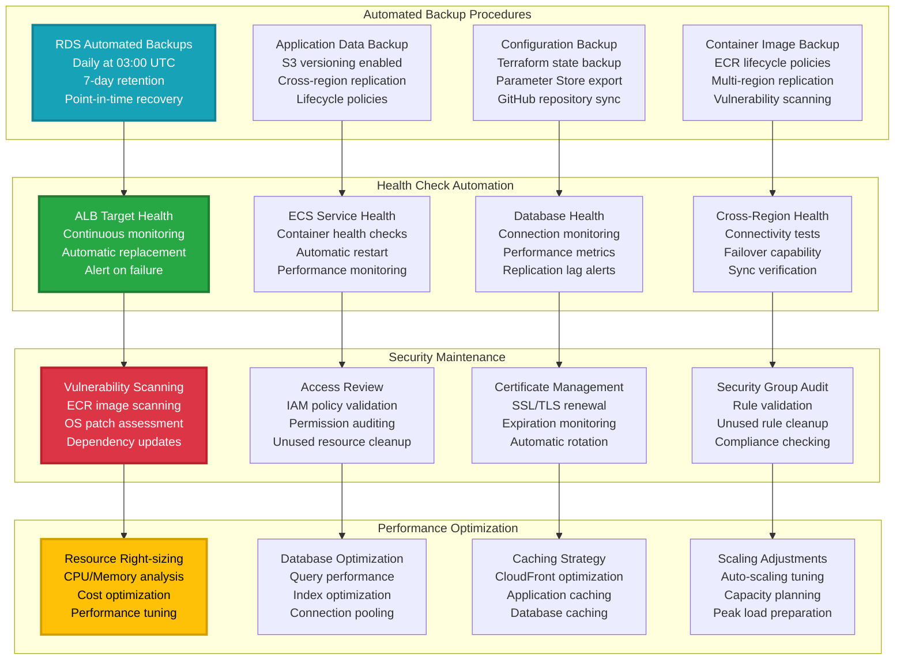

### Update and Patch Management

| Component | Update Frequency | Method | Downtime | Rollback Plan |
|-----------|------------------|---------|----------|---------------|
| **Application Code** | Per deployment | GitHub Actions CI/CD | Zero downtime | Previous container image |
| **Container Base Image** | Monthly | Rebuild and redeploy | Zero downtime | Previous image version |
| **ECS Fargate Platform** | Automatic | AWS managed | Zero downtime | Platform rollback |
| **Aurora Database** | Maintenance window | AWS managed | Minimal (2-3 min) | Point-in-time recovery |
| **ALB Configuration** | As needed | Terraform updates | Zero downtime | Configuration rollback |
| **Security Groups** | As needed | Terraform updates | Zero downtime | Rule reversion |
| **CloudFront Distribution** | As needed | Terraform/Console | Propagation delay | Origin switching |
| **Route 53 Records** | Emergency only | Manual/Automated | TTL-based | DNS reversion |

---

## Troubleshooting Guide

### Common Issues and Resolution Matrix

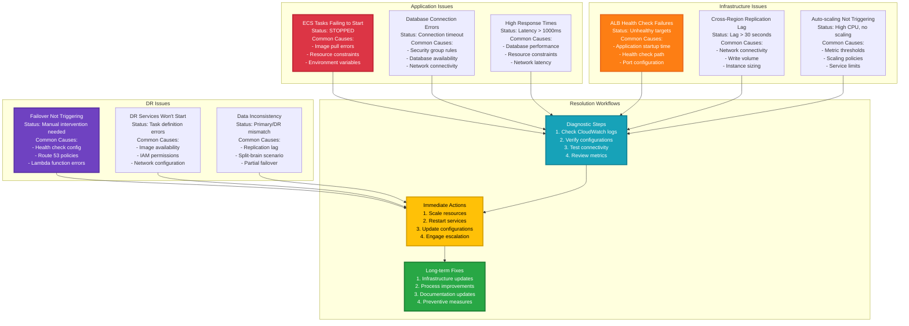

### Diagnostic Commands and Tools

#### ECS Service Diagnostics
```bash
# Check ECS service status
aws ecs describe-services \
  --cluster student-record-system-v2-cluster \
  --services student-record-system-v2-service \
  --region eu-central-1

# View task definition details
aws ecs describe-task-definition \
  --task-definition student-record-system-v2:latest

# Check stopped tasks for errors
aws ecs list-tasks \
  --cluster student-record-system-v2-cluster \
  --desired-status STOPPED \
  --max-items 10

# View CloudWatch logs
aws logs tail /aws/ecs/student-record-system-v2 \
  --follow --since 1h
```

#### Database Diagnostics
```bash
# Check Aurora cluster status
aws rds describe-db-clusters \
  --db-cluster-identifier student-record-system-v2-aurora-cluster \
  --region eu-central-1

# Monitor replication lag
aws rds describe-db-clusters \
  --db-cluster-identifier student-record-system-v2-aurora-cluster-replica \
  --region eu-west-1 \
  --query 'DBClusters[0].ReplicationSourceIdentifier'

# Check database connections
aws cloudwatch get-metric-statistics \
  --namespace AWS/RDS \
  --metric-name DatabaseConnections \
  --start-time $(date -u -d '1 hour ago' +%Y-%m-%dT%H:%M:%S) \
  --end-time $(date -u +%Y-%m-%dT%H:%M:%S) \
  --period 300 \
  --statistics Average
```

#### Load Balancer Diagnostics
```bash
# Check ALB target health
aws elbv2 describe-target-health \
  --target-group-arn $(aws elbv2 describe-target-groups \
    --names student-record-system-v2-tg \
    --query 'TargetGroups[0].TargetGroupArn' \
    --output text)

# Monitor ALB metrics
aws cloudwatch get-metric-statistics \
  --namespace AWS/ApplicationELB \
  --metric-name TargetResponseTime \
  --start-time $(date -u -d '1 hour ago' +%Y-%m-%dT%H:%M:%S) \
  --end-time $(date -u +%Y-%m-%dT%H:%M:%S) \
  --period 300 \
  --statistics Average
```

#### DR Status Verification
```bash
# Verify DR components
./scripts/verify-dr-status.sh

# Check CloudFront distribution
aws cloudfront get-distribution \
  --id $(aws ssm get-parameter \
    --name "/student-record-system-v2/cloudfront-distribution-id" \
    --query 'Parameter.Value' \
    --output text)

# Test failover capability
./scripts/test-failover-readiness.sh
```

### Emergency Contact and Escalation

| Severity | Contact Method | Response Time | Escalation |
|----------|---------------|---------------|------------|
| **Critical (P1)** | PagerDuty + Phone | 15 minutes | CTO after 30 minutes |
| **High (P2)** | Slack + Email | 30 minutes | Team Lead after 1 hour |
| **Medium (P3)** | Email + Slack | 2 hours | Daily standup discussion |
| **Low (P4)** | Ticket system | 24 hours | Weekly review |

---

## Development Workflow

### Contributing Guidelines

```mermaid
graph TD
    subgraph "Development Process"
        DEV1[Create Feature Branch<br/>Branch from main<br/>Descriptive naming<br/>issue/feature-description]
        DEV2[Local Development<br/>Code changes<br/>Local testing<br/>Docker validation]
        DEV3[Pre-commit Checks<br/>Terraform fmt<br/>Terraform validate<br/>Security scanning]
        DEV4[Commit and Push<br/>Descriptive messages<br/>Reference issues<br/>Sign commits]
    end
    
    subgraph "Review Process"
        REV1[Create Pull Request<br/>Detailed description<br/>Link to issues<br/>Deployment impact]
        REV2[Automated Testing<br/>Terraform plan<br/>Security scanning<br/>Code quality checks]
        REV3[Peer Review<br/>Code review<br/>Architecture review<br/>Security review]
        REV4[Approval Process<br/>2 approvals required<br/>All checks pass<br/>Deployment ready]
    end
    
    subgraph "Deployment Process"
        DEP1[Merge to Main<br/>Squash commits<br/>Update changelog<br/>Tag release]
        DEP2[Automated Deployment<br/>GitHub Actions<br/>Terraform apply<br/>Rolling deployment]
        DEP3[Post-deployment<br/>Health verification<br/>Monitoring checks<br/>Rollback if needed]
        DEP4[Documentation<br/>Update README<br/>Release notes<br/>Runbook updates]
    end
    
    DEV1 --> DEV2
    DEV2 --> DEV3
    DEV3 --> DEV4
    DEV4 --> REV1
    
    REV1 --> REV2
    REV2 --> REV3
    REV3 --> REV4
    REV4 --> DEP1
    
    DEP1 --> DEP2
    DEP2 --> DEP3
    DEP3 --> DEP4
    
    style DEV1 fill:#17a2b8,color:#ffffff,stroke:#138496,stroke-width:3px
    style REV2 fill:#ffc107,color:#000000,stroke:#d39e00,stroke-width:3px
    style DEP2 fill:#28a745,color:#ffffff,stroke:#1e7e34,stroke-width:3px
```

### Code Standards and Quality Gates

#### Terraform Standards
```hcl
# Required module structure
module "example" {
  source = "../../modules/component"
  
  # Required variables with descriptions
  project_name = var.project_name
  environment  = var.environment
  
  # Optional variables with defaults
  instance_count = var.instance_count != "" ? var.instance_count : 2
  
  tags = {
    Environment = var.environment
    Project     = var.project_name
    ManagedBy   = "Terraform"
  }
}

# Output all important values
output "component_arn" {
  value       = module.example.arn
  description = "ARN of the created component"
}
```

#### Application Standards
```php
<?php
// Required: All database queries use prepared statements
$stmt = $pdo->prepare("SELECT * FROM students WHERE id = ?");
$stmt->execute([$student_id]);
$result = $stmt->fetch(PDO::FETCH_ASSOC);

// Required: Input validation
function validateStudentData($data) {
    $errors = [];
    
    if (empty($data['name']) || !preg_match('/^[A-Za-z\s]+$/', $data['name'])) {
        $errors[] = "Invalid name format";
    }
    
    if (!filter_var($data['age'], FILTER_VALIDATE_INT, 
        ["options" => ["min_range" => 16, "max_range" => 100]])) {
        $errors[] = "Age must be between 16 and 100";
    }
    
    return $errors;
}

// Required: Error handling
try {
    $result = performDatabaseOperation();
} catch (PDOException $e) {
    error_log("Database error: " . $e->getMessage());
    throw new Exception("Operation failed. Please try again.");
}
?>
```

### Testing Requirements

| Test Type | Coverage | Tools | Frequency |
|-----------|----------|-------|-----------|
| **Unit Tests** | 80%+ | PHPUnit | Every commit |
| **Integration Tests** | Key workflows | Custom scripts | Every PR |
| **Infrastructure Tests** | Terraform validation | terraform plan | Every commit |
| **Security Tests** | OWASP compliance | SAST tools | Every PR |
| **Performance Tests** | Load testing | Artillery.js | Weekly |
| **DR Tests** | Failover scenarios | Custom scripts | Monthly |

### Release Management

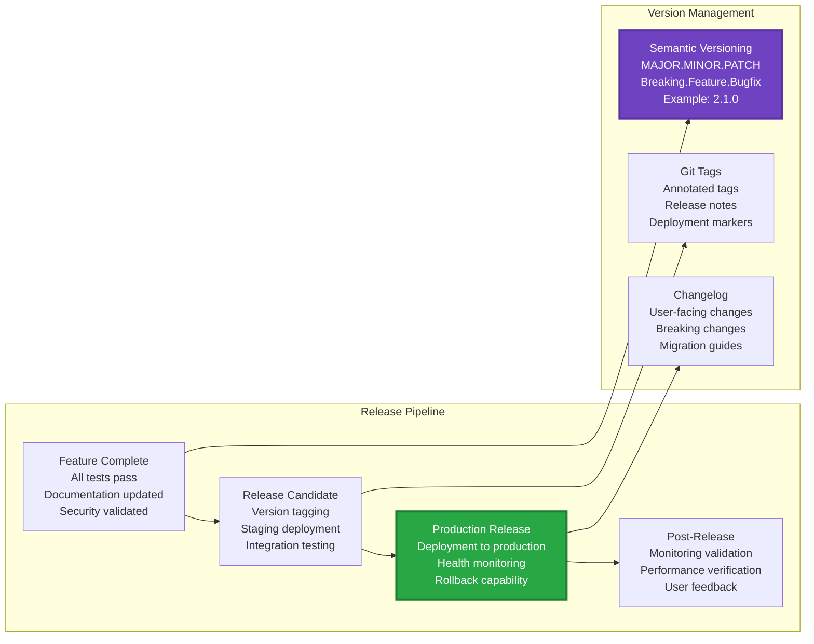

---

## Support and Documentation

### Support Channels

| Channel | Purpose | Response Time | Availability |
|---------|---------|---------------|--------------|
| **GitHub Issues** | Bug reports, feature requests | 24-48 hours | 24/7 |
| **Documentation** | Implementation guides, FAQs | Self-service | 24/7 |
| **Email Support** | General inquiries | 2-4 business hours | Business hours |
| **Emergency Contact** | Critical production issues | 15 minutes | 24/7 |

### Resource Links

- **AWS Documentation**: [AWS ECS Best Practices](https://docs.aws.amazon.com/AmazonECS/latest/bestpracticesguide/)
- **Terraform Documentation**: [AWS Provider](https://registry.terraform.io/providers/hashicorp/aws/latest)
- **Disaster Recovery Guide**: [AWS DR Strategies](https://aws.amazon.com/disaster-recovery/)
- **Security Best Practices**: [AWS Security Hub](https://aws.amazon.com/security-hub/)
- **GitHub Actions**: [Workflow Documentation](https://docs.github.com/en/actions)


---

**Docs Contribution**

*This documentation is maintained as part of the Infrastructure as Code practices. For updates or corrections, please submit a pull request or create an issue in the GitHub repository.*